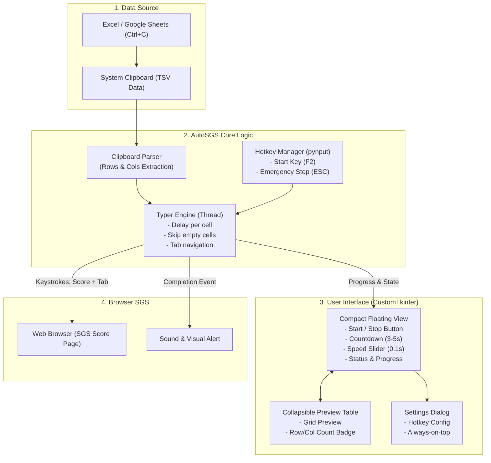

# AutoSGS Implementation Plan

## Goal Description
**AutoSGS** คือโปรแกรมช่วยอำนวยความสะดวกสำหรับครูผู้สอนในการนำคะแนนจากตารางสเปรดชีต (Excel / Google Sheets) ที่ถูกคัดลอกลงใน Clipboard มาจำลองการพิมพ์ (Keystroke Simulation) และกด `Tab` ลงในเว็บระบบงานวัดผล SGS (Secondary Grading System) โดยอัตโนมัติ เพื่อลดภาระงานซ้ำซ้อน ลดความเมื่อยล้า และป้องกันความผิดพลาดจากการกรอกคะแนนทีละคน

---

## User Review Required
> [!IMPORTANT]
> **ระบบปฏิบัติการ macOS และสิทธิ์ Accessibility**: การจำลองการกดแป้นพิมพ์ (Keyboard Automation) บน macOS จำเป็นต้องให้ผู้ใช้เปิดสิทธิ์ **Accessibility (การช่วยการเข้าถึง)** ใน *System Settings > Privacy & Security > Accessibility* ตัวโปรแกรมจะมีหน้าต่างแจ้งเตือนและแนะนำวิธีเปิดสิทธิ์ให้อัตโนมัติเมื่อรันครั้งแรกบน Mac

> [!NOTE]
> **Hotkeys & Emergency Stop**: 
> - ค่าเริ่มต้นสำหรับเริ่มพิมพ์: `F2` (หรือปุ่มที่ผู้ใช้ตั้งค่าได้)
> - ปุ่มหยุดฉุกเฉิน (Emergency Stop / Kill Switch): `ESC` ทำงานทันทีทุกกรณีเพื่อความปลอดภัย

---

## Architecture & System Design

---

## Proposed Changes

### 1. Core Logic Layer (`autosgs/core`)

#### [NEW] `autosgs/core/config_manager.py`
- โหลดและบันทึกการตั้งค่าของผู้ใช้ลงใน JSON (`~/.autosgs/config.json`)
- ค่าที่บันทึก: `delay_seconds` (default: 0.1), `countdown_seconds` (default: 3), `start_hotkey` (default: `F2`), `always_on_top` (default: `True`), `sound_enabled` (default: `True`).

#### [NEW] `autosgs/core/clipboard_parser.py`
- ดึงข้อมูลข้อความจาก Clipboard
- แยกแถว (`\r\n` หรือ `\n`) และคอลัมน์ (`\t` - Tab Separated)
- จัดการช่องว่าง (Empty/Whitespace-only cells) เพื่อเตรียมสำหรับส่ง `Tab` ข้าม
- คืนค่าโครงสร้างข้อมูล 2D list และ Metadata (จำนวนแถว, จำนวนคอลัมน์, สถิติข้อมูล)

#### [NEW] `autosgs/core/typer_engine.py`
- ทำงานบน Background Worker Thread เพื่อไม่ให้ UI ค้าง
- จำลองการกดแป้นพิมพ์ด้วย `pynput.keyboard.Controller`
- ลูปพิมพ์แนวนอนก่อน: Row $i$, Col $1 \rightarrow n$ ด้วย `Tab`
- ตรวจสอบ `stop_event` ตลอดเวลาเพื่อรองรับการหยุดฉุกเฉิน (Emergency Stop) ทันที
- ส่ง Progress callback (เช่น แถวปัจจุบัน / จำนวนแถวทั้งหมด) ไปอัปเดตหน้า UI

#### [NEW] `autosgs/core/hotkey_manager.py`
- ใช้ `pynput.keyboard.GlobalHotKeys` หรือ `Listener` ดักจับการกดปุ่มทั้งใน Windows และ Mac
- ผูกปุ่มเริ่ม (`F2` หรือตามที่ตั้งไว้) และปุ่มหยุดฉุกเฉิน (`ESC`)

#### [NEW] `autosgs/core/sound_notifier.py`
- เล่นเสียงแจ้งเตือนเมื่อพิมพ์เสร็จสิ้น (รองรับข้ามแพลตฟอร์ม: `winsound` บน Windows, `afplay` / terminal bell บน Mac)

---

### 2. User Interface Layer (`autosgs/ui`)

#### [NEW] `autosgs/ui/app.py`
- หน้าต่างหลักพัฒนาด้วย `customtkinter` (ดีไซน์โมเดิร์น รองรับ Dark/Light mode, คมชัดทุก DPI)
- **โหมดกะทัดรัด (Compact Mode):**
  - แสดงสถานะ: *พร้อมทำงาน (Ready)*, *กำลังพิมพ์ (Typing 15/40)*, *เสร็จสิ้น (Done)*, *หยุดฉุกเฉิน (Stopped)*
  - ปุ่ม "เริ่มพิมพ์" (มีตัวเลขนับถอยหลัง 3 วินาที เพื่อให้สลับหน้าจอไปคลิกช่องแรกได้ทัน)
  - Slider ปรับความเร็วหน่วงเวลา (Delay): 0.02s - 0.5s (ค่าเริ่มต้น 0.1s)
  - Checkbox / Toggle: "ให้อยู่ด้านบนเสมอ (Always on Top)"
  - ปุ่มคลี่/พับ "ดูตัวอย่างข้อมูล (Preview)"
- **ส่วนขยายตัวอย่างข้อมูล (Expandable Preview Panel):**
  - แสดงจำนวนแถวและคอลัมน์ที่ตรวจพบ
  - ตารางพรีวิวข้อมูลในคลิปบอร์ดแบบเรียลไทม์ พร้อมปุ่ม "รีเฟรชคลิปบอร์ด"

#### [NEW] `autosgs/ui/settings_dialog.py`
- หน้าต่างย่อยสำหรับตั้งค่าปุ่มลัด (Hotkey Recorder) และเปิด/ปิดเสียงเตือน

---

### 3. Application Entry & Packaging (`main.py`, DevOps Scripts)

#### [NEW] `main.py`
- จุดเริ่มต้นของโปรแกรม ตรวจสอบ OS, ตรวจสอบสิทธิ์เบื้องต้น และเริ่มต้นรันแอปพลิเคชัน

#### [NEW] `requirements.txt`
- กำหนด dependency: `customtkinter`, `pynput`, `pyperclip`, `pyinstaller`

#### [NEW] `packaging/build_windows.bat`
- คำสั่ง PyInstaller สำหรับ Build ออกมาเป็นไฟล์ `AutoSGS.exe` (Single-file Portable, มีไอคอน, ซ่อน Command Prompt Window)

#### [NEW] `packaging/build_mac.sh`
- สคริปต์ Build สำหรับ macOS (`AutoSGS.app` หรือ Standalone binary)

#### [NEW] `.github/workflows/build_release.yml`
- CI/CD Automation: เมื่อสร้าง Release Tag บน GitHub Action จะทำการ build ไฟล์ `.exe` สำหรับ Windows และ `.zip` สำหรับ Mac พร้อมแนบใน GitHub Release ให้ครูดาวน์โหลดได้ทันที

---

## Verification Plan

### Automated Tests
- **Clipboard Parsing Unit Tests**: ทดสอบการตัดคำแถว/คอลัมน์, ข้อมูลที่มีช่องว่าง, อักขระพิเศษ, ภาษาไทย
- **Typer Logic Mock Tests**: ทดสอบ Keystroke Generator ว่าสร้างลำดับ `Score + Tab` และ `Tab เปล่า` ถูกต้องตามโครงสร้างตาราง
- **Emergency Stop Latency Test**: ทดสอบว่าเมื่อ Trigger Stop แล้ว เธรดจะหยุดพิมพ์ทันทีภายในไม่เกิน 50ms

### Manual Verification
1. **การคัดลอกจาก Excel**: คัดลอกตารางคะแนน 1-3 คอลัมน์ ความยาว 40 คน แล้วเปิดดู Preview ในโปรแกรม
2. **การพิมพ์ลง Web Form จำลอง**:
   - สร้างไฟล์ HTML ฟอร์มจำลองตารางคะแนนแบบ SGS
   - ทดสอบการกดปุ่ม "เริ่ม" ด้วยการนับถอยหลัง 3 วินาที
   - ทดสอบการกดปุ่มลัด `F2` จากหน้าต่างเบราว์เซอร์
   - ตรวจสอบความถูกต้องของคะแนนทุกช่องและการข้ามช่องว่าง
3. **การหยุดฉุกเฉิน (Emergency Stop)**: กด `ESC` ขณะโปรแกรมกำลังพิมพ์ เพื่อยืนยันว่าการพิมพ์หยุดทันที
4. **การปรับความเร็ว**: ทดสอบปรับ Delay เป็น 0.05s, 0.1s, 0.2s สังเกตความแม่นยำและการตอบสนองของเบราว์เซอร์
5. **การทำงานข้ามแพลตฟอร์ม**: ตรวจสอบการรันบน Windows 10/11 และ macOS
