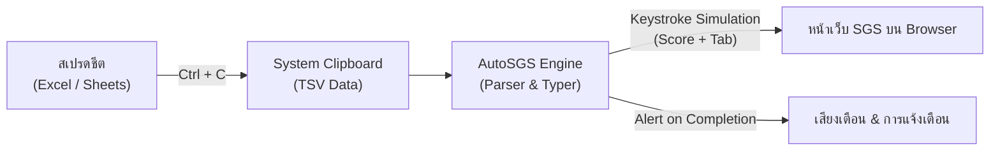

# AutoSGS: เอกสารข้อกำหนดความต้องการของระบบ (System Specification)

> **เวอร์ชัน:** 1.1.0  
> **สถานะ:** ร่างข้อกำหนดสมบูรณ์ (Approved Draft)  
> **เป้าหมายผู้ใช้งาน:** ครูผู้สอนระดับมัธยมศึกษาที่ต้องบันทึกคะแนนลงในระบบ SGS (Secondary Grading System)

---

## 1. ภาพรวมระบบ (System Overview)

### 1.1 ที่มาและความสำคัญ (Background)
ทุกสิ้นภาคเรียน ครูผู้สอนต้องนำคะแนนเก็บและคะแนนสอบที่บันทึกไว้ในสเปรดชีต (Microsoft Excel หรือ Google Sheets) มาพิมพ์ลงในระบบงานวัดผล SGS ผ่านเว็บเบราว์เซอร์ ซึ่งลักษณะของหน้าเว็บต้องการให้กรอกคะแนนแล้วกดปุ่ม `Tab` เพื่อเลื่อนไปยังช่องถัดไปอย่างต่อเนื่อง การกรอกข้อมูลนักเรียนครั้งละหลายห้องเรียน (ห้องละ 40–50 คน หลายรายวิชาและหลายตัวชี้วัด) ทำให้เกิดปัญหา:
- ความเมื่อยล้าและปัญหาสุขภาพ (Repetitive Strain Injury)
- ความผิดพลาดในการพิมพ์ตัวเลขและการลงคะแนนผิดช่อง
- ใช้ระยะเวลาในการทำงานเอกสารยาวนาน

### 1.2 วัตถุประสงค์ (Objectives)
**AutoSGS** คือโปรแกรม Desktop Utility ขนาดเล็กแบบพกพา (Portable) ที่ช่วยพิมพ์คะแนนอัตโนมัติจากข้อมูลใน Clipboard โดยจำลองการกดแป้นพิมพ์ (`คะแนน + Tab`) และส่งค่าลงในช่องกรอกบนเว็บเบราว์เซอร์อย่างแม่นยำ พร้อมระบบความปลอดภัยและการควบคุมที่ยืดหยุ่น

### 1.3 ขอบเขตของระบบ (System Scope)
- **ระบบปฏิบัติการเป้าหมาย:** Windows 10/11 และ macOS (Apple Silicon & Intel)
- **รูปแบบการติดตั้ง:** Portable Standalone Single-file Executable (`.exe` บน Windows, `.app`/Binary บน macOS) โดยผู้ใช้ไม่จำเป็นต้องติดตั้ง Python หรือเครื่องมือเสริมใดๆ
- **การเข้ากันได้:** ทำงานร่วมกับเว็บเบราว์เซอร์มาตรฐานทุกตัว (Google Chrome, Microsoft Edge, Mozilla Firefox, Safari)



---

## 2. Data Model & Configuration Schema

### 2.1 โครงสร้างข้อมูลใน Clipboard (Input Data Structure)
ข้อมูลที่คัดลอกมาจาก Excel หรือ Google Sheets จะอยู่ในรูปแบบข้อความตารางแบบ **Tab-Separated Values (TSV)**

```text
Row 1: [Score 1,1]\t[Score 1,2]\t[Score 1,3]\r\n
Row 2: [Score 2,1]\t[Score 2,2]\t[Score 2,3]\r\n
```

### 2.2 โมเดลข้อมูลภายในโปรแกรม (Internal Data Models)

#### A. ScoreMatrix (โครงสร้างตารางคะแนน)
```json
{
  "total_rows": 40,
  "total_columns": 3,
  "total_cells": 120,
  "empty_cells_count": 5,
  "rows": [
    ["18", "19", "20"],
    ["15", "", "17"],
    ["20", "20", "20"]
  ]
}
```

#### B. AppConfig (การตั้งค่าโปรแกรม `~/.autosgs/config.json`)
```json
{
  "delay_seconds": 0.1,
  "countdown_seconds": 3,
  "start_hotkey": "F2",
  "stop_hotkey": "Escape",
  "always_on_top": true,
  "sound_enabled": true,
  "theme": "System",
  "ui_scale": "Large"
}
```

#### C. TypingState (สถานะการทำงานของโปรแกรม)
- **Status Enum:**
  - `IDLE`: พร้อมทำงาน รอรับข้อมูล
  - `COUNTDOWN`: อยู่ระหว่างนับถอยหลังก่อนเริ่มพิมพ์
  - `TYPING`: กำลังจำลองการพิมพ์และกด Tab
  - `PAUSED`: พักชั่วคราว
  - `STOPPED`: หยุดการทำงานทันที (Emergency Stop)
  - `COMPLETED`: พิมพ์ครบถ้วนทุกช่องแล้ว
- **Progress Tracking:**
  - `current_row_index` (int)
  - `current_col_index` (int)
  - `percent_completed` (float)

---

## 3. ฟีเจอร์ทั้งหมดพร้อม Acceptance Criteria

### ฟีเจอร์ที่ 1: การประมวลผลข้อมูลจาก Clipboard (Clipboard Parser)
- **คำอธิบาย:** ตรวจจับและแยกข้อมูลตารางที่ผู้ใช้คัดลอกจากสเปรดชีต
- **Acceptance Criteria:**
  - [x] **AC 1.1:** รองรับการคัดลอกตารางที่มี 1 คอลัมน์ หรือมากกว่า 1 คอลัมน์ได้ถูกต้อง
  - [x] **AC 1.2:** ช่องว่างที่ไม่มีข้อมูล (Blank/Empty cell) จะต้องถูกระบุเป็นค่าว่าง และเตรียมส่งเพียงปุ่ม `Tab` เพื่อข้ามช่อง
  - [x] **AC 1.3:** ทำความสะอาดข้อมูล (Trim whitespace หัว-ท้าย) ของแต่ละช่องอัตโนมัติ
  - [x] **AC 1.4:** รองรับตัวเลขทศนิยม (เช่น `15.5`) และตัวอักษรภาษาไทยหากจำเป็น

---

### ฟีเจอร์ที่ 2: ระบบจำลองการพิมพ์ (Keystroke Traversal Engine)
- **คำอธิบาย:** ส่งการกดแป้นพิมพ์คะแนนและ `Tab` เข้าสู่หน้าต่างเว็บ SGS
- **Acceptance Criteria:**
  - [x] **AC 2.1 (Horizontal Traversal):** พิมพ์ข้อมูลในแนวนอนก่อน ($Row_i, Col_1 \rightarrow Col_2 \dots \rightarrow Col_n$) แล้วจึงเลื่อนไปยังแถวถัดไป
  - [x] **AC 2.2 (Blank Handling):** หากช่องใดเป็นช่องว่าง ระบบจะกดเฉพาะ `Tab` โดยไม่พิมพ์ตัวอักษรอื่น
  - [x] **AC 2.3 (Adjustable Delay):** มีการหน่วงเวลาระหว่างการกดแต่ละช่องตามค่า Delay ที่กำหนด (ค่าเริ่มต้น 0.1 วินาที / 100ms)
  - [x] **AC 2.4 (Non-blocking Execution):** กระบวนการพิมพ์ต้องทำงานบน Background Thread โดยไม่ทำให้ UI หลักของโปรแกรมหยุดตอบสนอง (Freeze)

---

### ฟีเจอร์ที่ 3: ระบบสั่งเริ่มพิมพ์แบบสองทาง (Dual-Trigger Control)
- **คำอธิบาย:** ครูสามารถสั่งเริ่มพิมพ์ได้ทั้งจากปุ่มลัดและระบบนับถอยหลัง
- **Acceptance Criteria:**
  - [x] **AC 3.1 (Global Hotkey):** เมื่อเปิดโปรแกรมไว้และสลับไปคลิกช่องแรกบนเว็บ SGS สามารถกดปุ่มลัด (ค่าเริ่มต้น `F2`) เพื่อเริ่มพิมพ์ได้ทันที
  - [x] **AC 3.2 (Countdown Mode):** เมื่อกดปุ่ม "เริ่มพิมพ์" บนหน้าต่างโปรแกรม จะมีตัวเลขนับถอยหลัง 3 วินาที (3.. 2.. 1..) พร้อมเสียงนับ ให้ผู้ใช้สลับหน้าจอไปคลิกช่องแรกได้ทัน
  - [x] **AC 3.3 (Custom Hotkey):** ผู้ใช้สามารถกดบันทึกและเปลี่ยนปุ่มลัดเริ่มต้นได้ในหน้าต่างการตั้งค่า

---

### ฟีเจอร์ที่ 4: ระบบหยุดฉุกเฉิน (Emergency Stop / Fail-safe)
- **คำอธิบาย:** ระบบหยุดการพิมพ์ทันทีเพื่อความปลอดภัยในกรณีคลิกผิดช่องหรือข้อมูลไม่ตรง
- **Acceptance Criteria:**
  - [x] **AC 4.1:** เมื่อกดปุ่ม `ESC` ขณะที่โปรแกรมกำลังพิมพ์ ระบบต้องหยุดการพิมพ์ทันที (Latency $\le 50$ms)
  - [x] **AC 4.2:** มีการแจ้งเตือนสถานะเป็น "หยุดฉุกเฉิน (Stopped)" บนหน้าต่างโปรแกรมอย่างชัดเจน

---

### ฟีเจอร์ที่ 5: ส่วนติดต่อผู้ใช้แบบไฮบริด (Hybrid UI / UX)
- **คำอธิบาย:** หน้าต่างที่กะทัดรัด ไม่บดบังหน้าเว็บ แต่สามารถคลี่ดูตารางตรวจสอบความถูกต้องได้
- **Acceptance Criteria:**
  - [x] **AC 5.1 (Compact Mode):** แสดงผลขนาดเล็ก ลอยอยู่หน้าจอ (Always on Top toggle) แสดงสถานะ, แถบความคืบหน้า (Progress bar), ปุ่มเริ่ม, และ Slider ปรับความเร็ว
  - [x] **AC 5.2 (Expandable Preview):** สามารถกดขยายเพื่อดูตารางสรุปข้อมูล แสดงจำนวนแถว/คอลัมน์ และตัวอย่างคะแนนก่อนพิมพ์
  - [x] **AC 5.3 (Modern Aesthetic):** ใช้ดีไซน์แบบ CustomTkinter รองรับ Dark Mode และ Light Mode คมชัดบนจอ Retina / High-DPI

---

### ฟีเจอร์ที่ 6: การแจ้งเตือนเมื่อเสร็จสิ้น (Sound & Visual Notification)
- **คำอธิบาย:** แจ้งเตือนให้ครูทราบเมื่อพิมพ์คะแนนครบถ้วนทุกช่องแล้ว
- **Acceptance Criteria:**
  - [x] **AC 6.1:** ส่งเสียงสัญญาณเตือน (Chime / Sound) เมื่อระบบพิมพ์ช่องสุดท้ายเสร็จสิ้น
  - [x] **AC 6.2:** แสดงข้อความสรุปจำนวนคะแนนที่พิมพ์สำเร็จบนหน้าจอ พร้อมปุ่มปิดเสียงในหน้าตั้งค่า

---

### ฟีเจอร์ที่ 7: การรองรับข้ามแพลตฟอร์มและไฟล์พร้อมใช้ (Cross-Platform & Portable Delivery)
- **คำอธิบาย:** ใช้งานได้บน Windows และ macOS โดยไม่ต้องติดตั้งสภาพแวดล้อมการเขียนโปรแกรม
- **Acceptance Criteria:**
  - [x] **AC 7.1:** ไฟล์ผลลัพธ์บน Windows เป็น `TUNorth - AutoSGS.exe` และ `AutoSGS.exe` แบบ Single-file Portable ดับเบิ้ลคลิกใช้งานได้ทันที
  - [x] **AC 7.2:** รองรับการทำงานบน macOS พร้อมหน้าต่างแนะนำการเปิดสิทธิ์ Accessibility
  - [x] **AC 7.3:** มีสคริปต์อัตโนมัติสำหรับการ Build ไฟล์ Release (`packaging/build_windows.bat`, `packaging/build_mac.sh`) พร้อมคู่มือขั้นตอนการ Build ใน `docs/build_guide.md`

---

### ฟีเจอร์ที่ 8: โหมดการบันทึกข้อมูลคะแนนตามประเภทงานวัดผล (3 Grading Modes)
- **คำอธิบาย:** สลับโหมดการพิมพ์คะแนนให้สอดคล้องกับตารางและช่องบนเว็บ SGS 3 รูปแบบ
- **Acceptance Criteria:**
  - [x] **AC 8.1 (โหมดผลการเรียน):** คะแนนรายวิชาทั่วไป แต่ละช่องพิมพ์คะแนน + Tab 1 ครั้ง เลื่อนไปคนถัดไปทันที (ไม่มี Tab เพิ่มเติม)
  - [x] **AC 8.2 (โหมดคุณลักษณะอันพึงประสงค์):** ช่อง 1–8 พิมพ์คะแนน + Tab 1 ครั้ง และส่ง `Tab` เพิ่มเติมอีก 4 ครั้งท้ายแถว เพื่อข้ามช่องคะแนนรวม/ฐานนิยม/ผลประเมิน/ปุ่ม ไปยังคนถัดไป
  - [x] **AC 8.3 (โหมดการอ่าน คิดวิเคราะห์และเขียน):** ช่อง 1–5 พิมพ์คะแนน + Tab 1 ครั้ง และส่ง `Tab` เพิ่มเติมอีก 3 ครั้งท้ายแถว เพื่อข้ามช่องสรุปผลไปยังคนถัดไป
  - [x] **AC 8.4 (Segmented Mode Switcher & Column Validation):** มีปุ่ม Segmented Button บนหน้าต่างหลักให้เลือกโหมดได้ทันที พร้อมระบบตรวจสอบแจ้งเตือนจำนวนคอลัมน์จากคลิปบอร์ด
  - [x] **AC 8.5 (Interactive Mock Form):** ฟอร์มจำลอง `tests/mock_sgs.html` รองรับทั้ง 3 โหมดพร้อมปุ่มคัดลอกตัวอย่างและปุ่มจำลองบันทึกครบถ้วน
  - [x] **AC 8.6 (Save Reminder Banner):** เมื่อพิมพ์เสร็จในโหมดคุณลักษณะฯ และการอ่านฯ จะแสดงแถบแจ้งเตือนสีส้มเตือนให้กดบันทึกใน SGS เสมอ
  - [x] **AC 8.7 (Per-Mode Delay & Turbo Speed):** บันทึกค่าความเร็วหน่วงเวลาแยกอิสระในแต่ละโหมด โดยโหมดคุณลักษณะฯ และการอ่านฯ มีค่าเริ่มต้นความเร็วสูงสุด 0.02s (20ms ⚡) และโหมดผลการเรียนค่าเริ่มต้น 0.10s (100ms)

---

## 4. แผนการพัฒนาแบ่งตาม Phase (Phased Implementation Plan)

### Phase 1: Core Engine & Automation Logic (สถาปัตยกรรมหลักและระบบอัตโนมัติ)
- [x] **1.1 สร้างโครงสร้างโปรเจกต์**
  - [x] จัดเตรียมโฟลเดอร์ `autosgs/core`, `autosgs/ui`, `assets`, `tests`, `docs`
  - [x] สร้างไฟล์ `requirements.txt` และกำหนดเวอร์ชัน dependencies
- [x] **1.2 โมดูลอ่านและแปลงข้อมูลคลิปบอร์ด (`autosgs/core/clipboard_parser.py`)**
  - [x] เขียนฟังก์ชันดึงข้อความจาก Clipboard
  - [x] เขียนฟังก์ชันแปลงข้อความ TSV เป็นโครงสร้างตาราง 2 มิติ
  - [x] รองรับการตัดช่องว่าง (Sanitize) และนับจำนวนแถว/คอลัมน์
- [x] **1.3 โมดูลสั่งพิมพ์จำลอง (`autosgs/core/typer_engine.py`)**
  - [x] พัฒนา Keystroke Simulator ด้วย `pynput`
  - [x] ควบคุมการวนลูปแบบแนวนอนก่อน (Row-by-Row)
  - [x] จัดการกรณีช่องว่างโดยกดเฉพาะ `Tab`
  - [x] รองรับการทำงานแบบ Thread พร้อมตัวแปรควบคุม `threading.Event` สำหรับหยุดฉุกเฉิน
- [x] **1.4 โมดูลดักจับปุ่มลัดและหยุดฉุกเฉิน (`autosgs/core/hotkey_manager.py`)**
  - [x] ผูก Global Hotkey (Default: `F2`) เพื่อเริ่มพิมพ์
  - [x] ผูกปุ่ม `ESC` เป็น Kill Switch สำหรับ Emergency Stop
- [x] **1.5 ระบบแจ้งเตือนด้วยเสียง (`autosgs/core/sound_notifier.py`)**
  - [x] พัฒนาระบบเล่นเสียงแบบข้ามแพลตฟอร์ม (Windows/macOS)

---

### Phase 2: User Interface Development (ส่วนติดต่อผู้ใช้)
- [x] **2.1 สร้างหน้าต่างหลักแบบกะทัดรัด (`autosgs/ui/app.py`)**
  - [x] วาง Layout หน้าต่างขนาดเล็ก พร้อมคุณสมบัติ Always-on-Top
  - [x] สร้างตัวแสดงสถานะ (Status Badge: Ready, Countdown, Typing, Completed, Stopped)
  - [x] สร้างแถบแสดงความคืบหน้า (Progress Bar)
  - [x] สร้างปุ่ม "เริ่มพิมพ์" และตัวนับเวลาถอยหลัง (3 วินาที)
  - [x] สร้าง Slider ปรับความเร็ว Delay (0.02s – 0.5s)
- [x] **2.2 พัฒนาส่วนแสดงตัวอย่างข้อมูล (Collapsible Preview Panel)**
  - [x] เพิ่มปุ่มสลับพับ/ขยายหน้าต่าง (Accordion toggle)
  - [x] สร้างตาราง Preview แสดงข้อมูลในคลิปบอร์ดพร้อม Badge จำนวนแถวและคอลัมน์
  - [x] เพิ่มปุ่ม "รีเฟรชข้อมูลจากคลิปบอร์ด"
- [x] **2.3 โมดูลจัดการการตั้งค่าและบันทึกข้อมูล (`autosgs/core/config_manager.py`)**
  - [x] เขียนระบบบันทึกและโหลดค่าคอนฟิกจาก `~/.autosgs/config.json`
- [x] **2.4 หน้าต่างตั้งค่า (`autosgs/ui/settings_dialog.py`)**
  - [x] หน้าต่างเปลี่ยนปุ่มลัด (Hotkey Recorder)
  - [x] สวิตช์เปิด/ปิดเสียงแจ้งเตือน

---

### Phase 3: System Integration & Mock Verification (การผสานระบบและการทดสอบ)
- [x] **3.1 เชื่อมต่อ UI กับ Core Typer Engine**
  - [x] ส่งผ่าน Event การเริ่ม การหยุด และ Progress จาก Thread กลับมาอัปเดต UI อย่างปลอดภัย (Thread-safe)
- [x] **3.2 สร้างหน้าต่างทดสอบจำลอง (Mock SGS Web Form)**
  - [x] สร้างไฟล์ HTML ตารางกรอกคะแนนจำลอง (40 แถว, 3 คอลัมน์) เพื่อใช้ทดสอบการกด Tab และพิมพ์คะแนน
- [x] **3.3 เขียน Unit Tests อัตโนมัติ (`tests/`)**
  - [x] ทดสอบความถูกต้องของ `clipboard_parser` กับข้อมูลรูปแบบต่างๆ
  - [x] ทดสอบความเร็วและการตอบสนองของ `Emergency Stop` (หยุดทันทีเมื่อสั่ง)
- [x] **3.4 ทดสอบการทำงานจริงกับ Excel / Google Sheets**
  - [x] ทดสอบคัดลอก 1 คอลัมน์, 3 คอลัมน์, ตารางที่มีช่องว่าง

---

### Phase 4: Packaging & DevOps CI/CD (การจัดทำไฟล์พกพาและการแจกจ่าย)
- [x] **4.1 สร้างสคริปต์ PyInstaller สำหรับ Windows**
  - [x] จัดทำ `packaging/build_windows.bat` สำหรับแพ็กเป็น `AutoSGS.exe` (Single-file, no-console, มี Icon)
- [x] **4.2 สร้างสคริปต์สำหรับ macOS**
  - [x] จัดทำ `packaging/build_mac.sh` สำหรับแพ็กไฟล์แอปพลิเคชันบน macOS
  - [x] เพิ่มคำแนะนำการอนุญาต Accessibility Permission
- [x] **4.3 จัดทำ CI/CD Pipeline (`.github/workflows/build_release.yml`)**
  - [x] สร้าง GitHub Actions เพื่อ Build release binary สำหรับ Windows และ Mac อัตโนมัติเมื่อมี Release tag
- [x] **4.4 จัดทำคู่มือการใช้งาน (`docs/user_guide.md` และ `README.md`)**
  - [x] เขียนวิธีใช้งานแบบเข้าใจง่ายสำหรับคุณครู
  - [x] จัดทำ FAQ และวิธีแก้ปัญหาเบื้องต้น
- [x] **4.5 จัดทำคู่มือขั้นตอนการ Build และคอมไพล์โปรแกรม (`docs/build_guide.md`)**
  - [x] บันทึกคำสั่ง PyInstaller สำหรับ Windows และ macOS พร้อมคำอธิบายพารามิเตอร์
  - [x] บันทึกการแก้ไขปัญหาที่พบบ่อย (Permission Error, ล็อกไฟล์, Assets & Fonts)
- [x] **4.6 เผยแพร่โปรเจกต์และ Release บน GitHub ([https://github.com/NOGiTTiS/AutoSGS](https://github.com/NOGiTTiS/AutoSGS))**
  - [x] จัดทำ `.gitignore` กรองไฟล์ไบนารีและแคช
  - [x] ส่ง Source Code ขึ้น Branch `main`
  - [x] แก้ไขการรองรับไอคอน macOS (`assets/icon.icns`) ใน CI/CD
  - [x] สร้าง Git Tag `v1.0.0` และเผยแพร่ไฟล์โปรแกรมผ่าน GitHub Releases อัตโนมัติ
