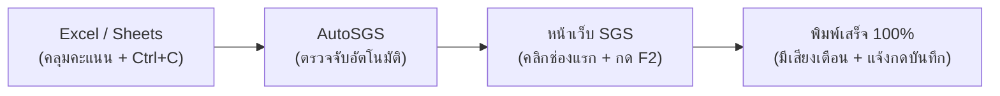
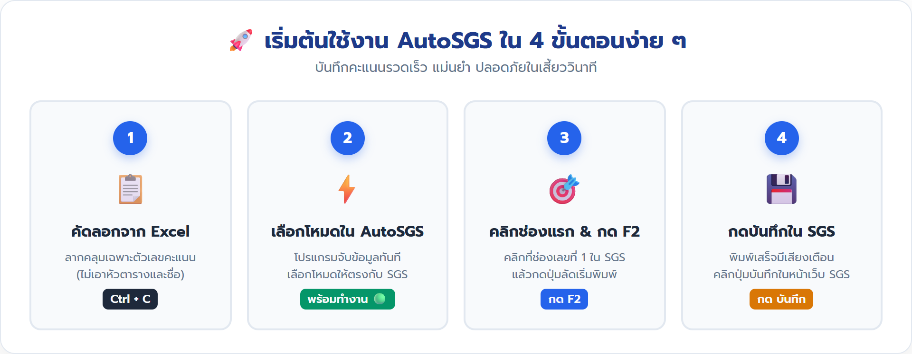
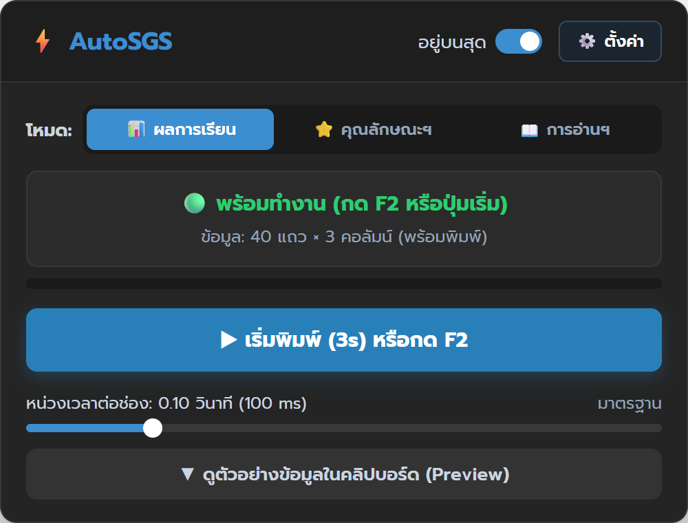
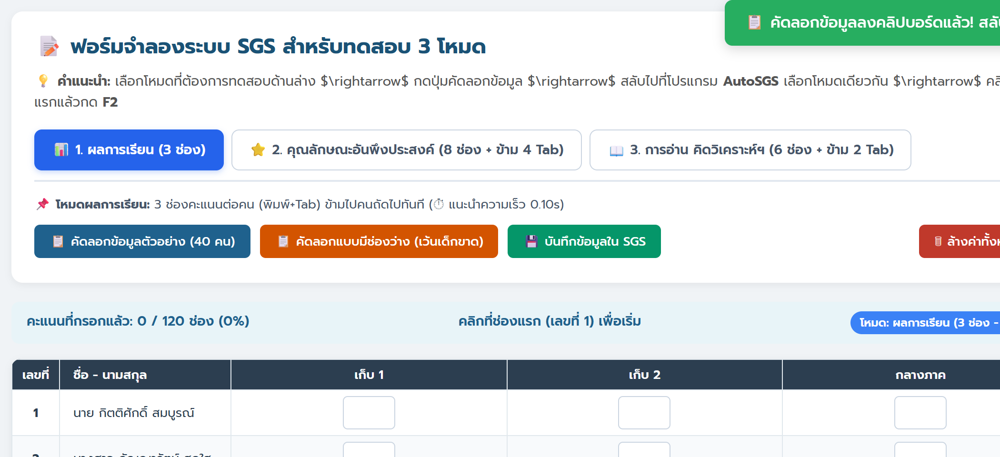
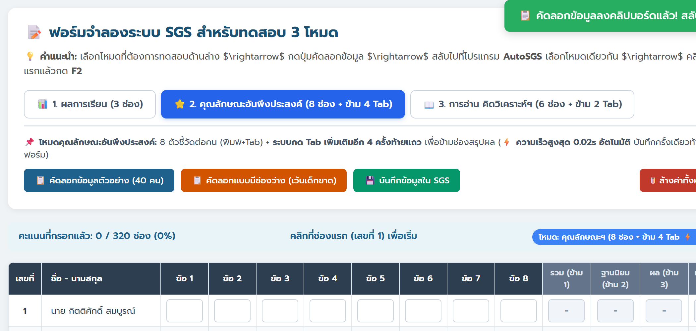
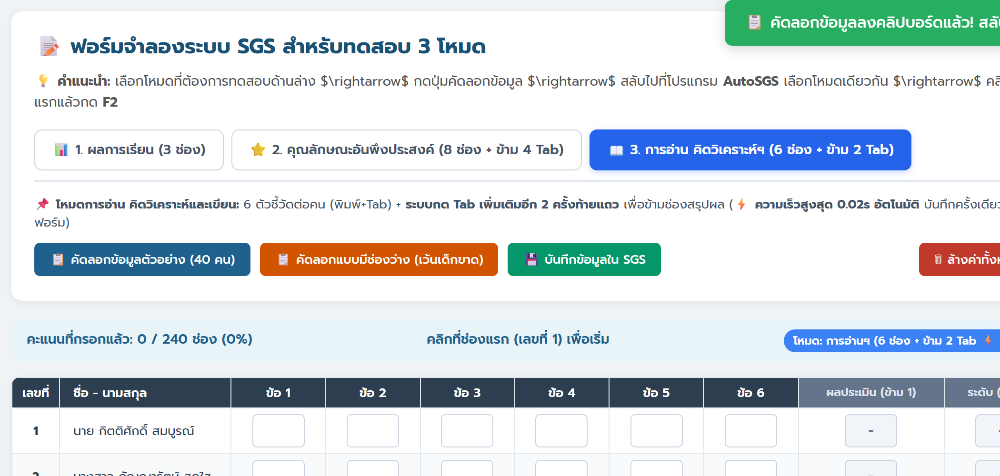
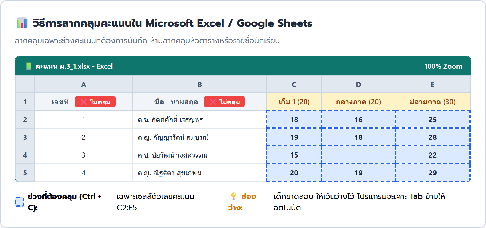
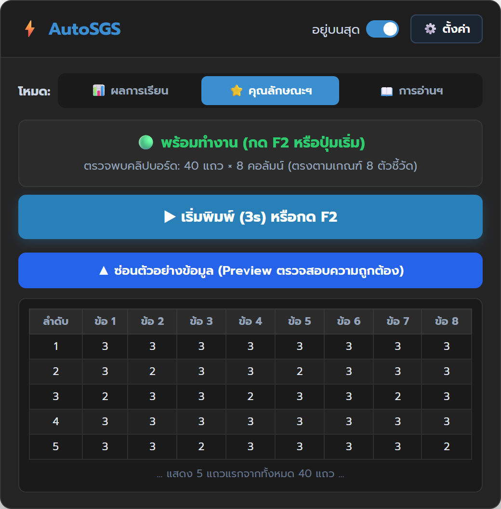
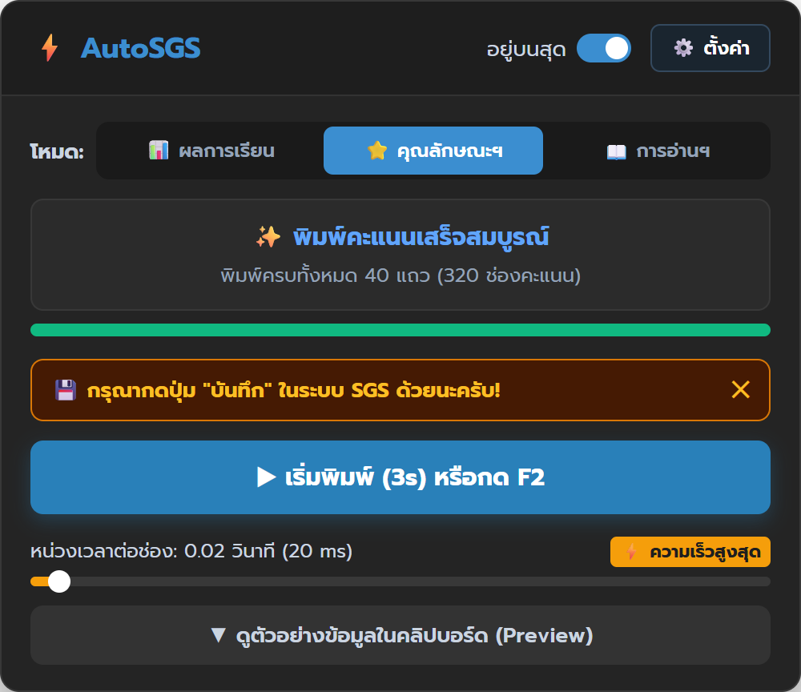
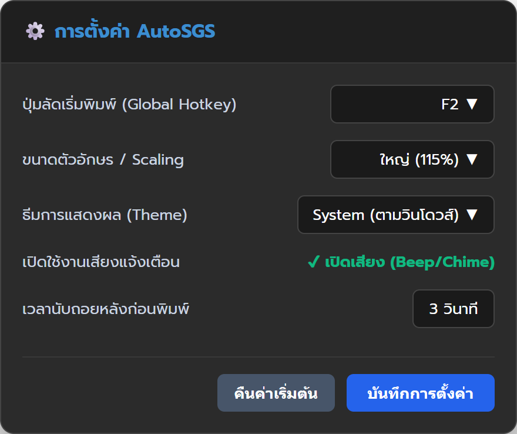

# คู่มือการใช้งานโปรแกรม AutoSGS อย่างละเอียด (User Manual)

> **AutoSGS** — ระบบช่วยพิมพ์คะแนนอัตโนมัติจาก Clipboard สำหรับครูผู้สอนบันทึกคะแนนในระบบ SGS (Secondary Grading System)  
> *พัฒนาขึ้นเพื่อลดภาระงานครู ป้องกันอาการปวดเมื่อยมือ และเพิ่มความถูกต้องแม่นยำในการบันทึกคะแนน 100%*

> 📥 **ดาวน์โหลดเอกสารในรูปแบบอื่น ๆ:**  
> - 📕 **[ดาวน์โหลดคู่มือฉบับสมบูรณ์ (PDF Manual)](AutoSGS_User_Manual.pdf)**  
> - 📊 **[ดาวน์โหลดสไลด์ประกอบการอบรม (PowerPoint PPTX Presentation)](AutoSGS_User_Manual.pptx)**  

---

## 📑 สารบัญ (Table of Contents)

1. [บทนำและความเป็นมา (Introduction & Overview)](#1-บทนำและความเป็นมา-introduction--overview)
2. [ความต้องการของระบบและการติดตั้ง (System Requirements & Setup)](#2-ความต้องการของระบบและการติดตั้ง-system-requirements--setup)
3. [โครงสร้างหน้าต่างและส่วนประกอบของโปรแกรม (UI Anatomy & Walkthrough)](#3-โครงสร้างหน้าต่างและส่วนประกอบของโปรแกรม-ui-anatomy--walkthrough)
4. [เจาะลึก 3 โหมดการทำงาน (Detailed 3 Grading Modes)](#4-เจาะลึก-3-โหมดการทำงาน-detailed-3-grading-modes)
   - [4.1 โหมดผลการเรียน (Academic Scores)](#41-โหมดผลการเรียน-academic-scores)
   - [4.2 โหมดคุณลักษณะอันพึงประสงค์ (8 ตัวชี้วัด)](#42-โหมดคุณลักษณะอันพึงประสงค์-8-ตัวชี้วัด)
   - [4.3 โหมดการอ่าน คิดวิเคราะห์และเขียน (6 ตัวชี้วัด)](#43-โหมดการอ่าน-คิดวิเคราะห์และเขียน-6-ตัวชี้วัด)
5. [ขั้นตอนการใช้งานแบบ Step-by-Step (Step-by-Step Guide)](#5-ขั้นตอนการใช้งานแบบ-step-by-step-step-by-step-guide)
   - [ขั้นตอนที่ 1: การเตรียมข้อมูลและคัดลอกจาก Excel / Google Sheets](#ขั้นตอนที่-1-การเตรียมข้อมูลและคัดลอกจาก-excel--google-sheets)
   - [ขั้นตอนที่ 2: การตรวจสอบข้อมูลใน AutoSGS](#ขั้นตอนที่-2-การตรวจสอบข้อมูลใน-autosgs)
   - [ขั้นตอนที่ 3: การสั่งเริ่มพิมพ์ลงหน้าเว็บ SGS (2 วิธี)](#ขั้นตอนที่-3-การสั่งเริ่มพิมพ์ลงหน้าเว็บ-sgs-2-วิธี)
   - [ขั้นตอนที่ 4: การตรวจสอบและการกดบันทึกใน SGS](#ขั้นตอนที่-4-การตรวจสอบและการกดบันทึกใน-sgs)
6. [ระบบความปลอดภัยและการหยุดฉุกเฉิน (Emergency Stop & Safety)](#6-ระบบความปลอดภัยและการหยุดฉุกเฉิน-emergency-stop--safety)
7. [การตั้งค่าโปรแกรมโดยละเอียด (Settings & Customization)](#7-การตั้งค่าโปรแกรมโดยละเอียด-settings--customization)
8. [เทคนิคและข้อควรระวังเพื่อความแม่นยำสูงสุด (Pro Tips & Best Practices)](#8-เทคนิคและข้อควรระวังเพื่อความแม่นยำสูงสุด-pro-tips--best-practices)
9. [การแก้ไขปัญหาและคำถามที่พบบ่อย (Troubleshooting & FAQs)](#9-การแก้ไขปัญหาและคำถามที่พบบ่อย-troubleshooting--faqs)

---

## 1. บทนำและความเป็นมา (Introduction & Overview)

### ปัญหาจริงที่ครูผู้สอนทุกคนต้องเผชิญ
ทุกสิ้นภาคเรียน ครูต้องส่งคะแนนนักเรียนเข้าระบบ SGS ของ สพฐ. โดยในแต่ละห้องมีนักเรียนประมาณ 40–50 คน และครูแต่ละท่านมักสอนหลายห้อง:
- หากครูมีนักเรียน 5 ห้อง (ประมาณ 200 คน) ต้องกรอกคะแนนย่อย 5 ช่อง = **1,000 ช่อง**
- ในการประเมินคุณลักษณะอันพึงประสงค์ 8 ข้อ = **1,600 ช่อง**
- ในการประเมินการอ่าน คิดวิเคราะห์และเขียน 5 ข้อ = **1,000 ช่อง**
- **รวมกันแล้ว ครูต้องกดแป้นพิมพ์ตัวเลขและกดปุ่ม Tab เกือบ 3,600–4,000 ครั้ง!**
- ผลที่ตามมาคือ อาการเมื่อยล้าข้อมือ, ตาพร่ามัว, เสี่ยงคลิกผิดช่องจนคะแนนเลื่อนทั้งแถว และเสียเวลาทำงานอื่นหลายวัน

### AutoSGS ช่วยคุณครูอย่างไร?
AutoSGS เป็นโปรแกรมขนาดกะทัดรัด (Portable Desktop Utility) ที่ทำงานบนหลักการจำลองแป้นพิมพ์อัตโนมัติ (Keystroke Emulation):
1. **อ่านข้อมูลจาก Clipboard:** ครูเพียงแค่ลากคลุมคะแนนใน Excel หรือ Google Sheets แล้วกด `Ctrl + C`
2. **โปรแกรมจับข้อมูลทันที:** AutoSGS จะตรวจจับและคำนวณจำนวนคน/จำนวนช่องให้อัตโนมัติในหน่วยมิลลิวินาที
3. **พิมพ์แทนมือครู:** ครูคลิกช่องแรกในเว็บ SGS แล้วกดปุ่ม `F2` โปรแกรมจะพิมพ์คะแนนและกด `Tab` เลื่อนช่องให้อย่างแม่นยำ พร้อมระบบข้ามช่องสรุปให้อัตโนมัติ!



<p align="center">
  
</p>

---

## 2. ความต้องการของระบบและการติดตั้ง (System Requirements & Setup)

### ระบบปฏิบัติการที่รองรับ
- **Windows (แนะนำ):** รองรับ Windows 10 (64-bit) และ Windows 11 ทุกเวอร์ชัน
- **macOS:** รองรับ macOS 12 (Monterey), macOS 13 (Ventura), macOS 14 (Sonoma) ขึ้นไป (ทั้งชิป Intel และ Apple Silicon M1/M2/M3)
- **โปรแกรมตารางข้อมูลต้นทาง:** Excel ทุกเวอร์ชัน, Google Sheets, LibreOffice Calc, Apple Numbers, หรือข้อความแบบ Tab-Separated Values (TSV)
- **เว็บเบราว์เซอร์ที่ใช้เปิด SGS:** Google Chrome, Microsoft Edge, Mozilla Firefox, Brave, Safari

### การดาวน์โหลดและเริ่มใช้งาน
AutoSGS ถูกออกแบบมาในรูปแบบ **Standalone Portable Application** จึงมีความสะดวกสูงสุด:
- ✅ **ไม่ต้องติดตั้งโปรแกรม (No Installation)**
- ✅ **ไม่ต้องลง Python หรือโปรแกรมเสริมใด ๆ**
- ✅ **สามารถคัดลอกใส่แฟลชไดรฟ์ (USB Drive) ไปเปิดใช้ที่โรงเรียนหรือบ้านได้ทันที**

#### สำหรับระบบ Windows:
1. ดาวน์โหลดไฟล์ `AutoSGS.exe` จากลิงก์ทางการของโปรแกรม
2. ดับเบิลคลิกไฟล์ `AutoSGS.exe` เพื่อเปิดใช้งานได้ทันที
3. *(หมายเหตุ: หาก Windows Defender SmartScreen แสดงหน้าต่างเตือน ให้คลิก **"More info" (ข้อมูลเพิ่มเติม)** แล้วคลิก **"Run anyway" (เรียกใช้ต่อไป)**)*

#### สำหรับระบบ macOS:
1. ดาวน์โหลดและแตกไฟล์ `.zip` จะได้แอปพลิเคชัน `AutoSGS.app`
2. ลากไฟล์ไปไว้ในโฟลเดอร์ `Applications`
3. **สำคัญมากสำหรับ Mac:** ต้องเปิดสิทธิ์การจำลองแป้นพิมพ์ (Accessibility):
   - เปิด **System Settings (การตั้งค่าระบบ)** $\rightarrow$ **Privacy & Security (ความเป็นส่วนตัวและความปลอดภัย)**
   - คลิกเลือก **Accessibility (การช่วยการเข้าถึง)**
   - กดปุ่ม **+** แล้วเลือกเพิ่มแอป **AutoSGS** และเปิดสวิตช์เป็นสีน้ำเงิน

---

## 3. โครงสร้างหน้าต่างและส่วนประกอบของโปรแกรม (UI Anatomy & Walkthrough)

หน้าต่าง AutoSGS ถูกออกแบบด้วยแนวคิด Minimal & Compact เพื่อให้ลอยอยู่มุมจอโดยไม่บดบังตารางคะแนนในหน้าเว็บ SGS:

<p align="center">
  
</p>

```text
┌────────────────────────────────────────────────────────┐
│ ⚡ AutoSGS                  [✔ อยู่บนสุด]  [⚙️ ตั้งค่า] │  <- แถบหัวโปรแกรม
├────────────────────────────────────────────────────────┤
│ โหมด: [ 📊 ผลการเรียน ] [ ⭐ คุณลักษณะฯ ] [ 📖 การอ่านฯ ]│  <- แถบเลือกโหมด (3 โหมด)
├────────────────────────────────────────────────────────┤
│ ┌────────────────────────────────────────────────────┐ │
│ │ 🟢 พร้อมทำงาน (กด F2 หรือปุ่มเริ่ม)                  │ │  <- กล่องสถานะการทำงาน
│ │ ข้อมูล: 40 แถว × 8 คอลัมน์ (พร้อมพิมพ์)              │ │
│ └────────────────────────────────────────────────────┘ │
│ [████████████████████████████████████████░░░░░░░░] 75%  │  <- แถบความคืบหน้า (Progress Bar)
├────────────────────────────────────────────────────────┤
│ 💾 กรุณากดปุ่ม "บันทึก" ในระบบ SGS ด้วยนะครับ!       [✕] │  <- แถบเตือนกดบันทึก (โหมดประเมิน)
├────────────────────────────────────────────────────────┤
│ [ ▶ เริ่มพิมพ์ (3s) หรือกด F2                        ] │  <- ปุ่มสั่งเริ่ม / ปุ่มหยุดสีแดง
├────────────────────────────────────────────────────────┤
│ หน่วงเวลาต่อช่อง: 0.02 วินาที (20 ms) ⚡ ความเร็วสูงสุด  │  <- แถบสไลเดอร์ปรับความเร็ว
│ [─────────●──────────────────────────────────────────] │
├────────────────────────────────────────────────────────┤
│ [▼ ดูตัวอย่างข้อมูลในคลิปบอร์ด (Preview)             ] │  <- ปุ่มเปิด/ปิดพรีวิวตารางข้อมูล
└────────────────────────────────────────────────────────┘
```

### หน้าที่ของแต่ละส่วนประกอบ:

1. **สวิตช์ "อยู่บนสุด" (Always on Top):**
   - เมื่อเปิดไว้ (ค่าเริ่มต้น) หน้าต่างโปรแกรมจะลอยอยู่เหนือหน้าต่างเบราว์เซอร์เสมอ ทำให้คุณครูมองเห็นสถานะ ความคืบหน้า และปุ่มหยุดฉุกเฉินได้ตลอดเวลา
2. **ปุ่ม "⚙️ ตั้งค่า" (Settings):**
   - ใช้เปิดหน้าต่างตั้งค่าปุ่มลัด (Hotkey), ปรับขนาดตัวอักษร, เปลี่ยนธีม (Dark/Light) และเปิด/ปิดเสียง
3. **แถบเลือกโหมด (Mode Segmented Buttons):**
   - ใช้เลือกให้ตรงกับประเภทงานที่กำลังกรอกใน SGS (คะแนนรายวิชา, คุณลักษณะ 8 ข้อ, การอ่านฯ 6 ข้อ)
4. **กล่องสถานะ (Status Badge) & Progress Bar:**
   - แสดงสถานะแบบเรียลไทม์ เช่น `🟢 พร้อมทำงาน`, `⏳ กำลังพิมพ์...`, `🛑 หยุดการพิมพ์แล้ว`, `✨ พิมพ์คะแนนเสร็จสมบูรณ์`
   - แถบ Progress Bar แสดงเปอร์เซ็นต์ความคืบหน้าระหว่างที่โปรแกรมกำลังพิมพ์
5. **แถบเตือนกดบันทึก (Save Reminder Banner):**
   - จะปรากฏเป็นแถบสีส้มเด่นชัดเมื่อพิมพ์ข้อมูลในโหมดคุณลักษณะฯ หรือการอ่านฯ ครบแล้ว เพื่อเตือนคุณครูไม่ให้ลืมกดบันทึกบนหน้าเว็บ SGS
6. **แถบแจ้งเตือนจำนวนช่อง (Smart Column Validation Warning):**
   - หากคุณครูเลือกโหมดคุณลักษณะฯ (ต้องใช้ 8 ช่อง) แต่ในคลิปบอร์ดมี 5 ช่อง ระบบจะขึ้นกรอบเตือนสีส้มแจ้งให้ตรวจสอบทันที ป้องกันการกรอกผิดพลาด
7. **ปุ่มสั่งการหลัก (Action Button):**
   - ในสภาวะปกติ จะเป็นปุ่มสีน้ำเงิน `▶ เริ่มพิมพ์ (3s) หรือกด F2`
   - เมื่อกำลังพิมพ์ จะเปลี่ยนเป็นปุ่มสีแดงขนาดใหญ่ `⏹ หยุดฉุกเฉิน (ESC)`
8. **แถบปรับความเร็ว (Speed Slider):**
   - ปรับความเร็วในการหน่วงเวลาเคาะแป้นพิมพ์ (0.01 – 0.50 วินาที)
   - มีระบบจำค่าความเร็วแยกแต่ละโหมดให้อัตโนมัติ (เช่น โหมดคะแนนเก็บใช้ 0.10s, โหมดประเมินใช้ Turbo 0.02s ⚡)
9. **แผงพรีวิวข้อมูล (Collapsible Preview Panel):**
   - เมื่อคลิก จะขยายหน้าต่างลงมา แสดงตารางคะแนนจริงที่โปรแกรมอ่านได้จากคลิปบอร์ด เพื่อให้ตรวจเช็คความถูกต้องก่อนสั่งพิมพ์

---

## 4. เจาะลึก 3 โหมดการทำงาน (Detailed 3 Grading Modes)

ระบบ SGS ของ สพฐ. มีโครงสร้างตารางและพฤติกรรมการรับข้อมูลที่แตกต่างกันในแต่ละหน้า AutoSGS จึงสร้างตรรกะการกด Tab ให้ตรงกับระบบ SGS โดยเฉพาะ:

```text
┌────────────────────────────────────────────────────────────────────────────────────────┐
│                              เปรียบเทียบพฤติกรรมการพิมพ์ของทั้ง 3 โหมด                     │
├──────────────────────────┬──────────────┬────────────────────────┬─────────────────────┤
│ โหมด                      │ จำนวนช่อง     │ การกดปุ่มในแต่ละช่อง    │ การกดปุ่มท้ายแถวคน   │
├──────────────────────────┼──────────────┼────────────────────────┼─────────────────────┤
│ 1. 📊 ผลการเรียน          │ อิสระ (1 - N)│ [คะแนน] + Tab 1 ครั้ง   │ ไม่มี Tab พิเศษ      │
│ 2. ⭐ คุณลักษณะอันพึงประสงค์ │ 8 ตัวชี้วัด   │ [คะแนน] + Tab 1 ครั้ง   │ กด Tab เพิ่มอีก 4 ครั้ง│
│ 3. 📖 การอ่าน คิดวิเคราะห์ฯ   │ 5 ตัวชี้วัด   │ [คะแนน] + Tab 1 ครั้ง   │ กด Tab เพิ่มอีก 3 ครั้ง│
└──────────────────────────┴──────────────┴────────────────────────┴─────────────────────┤
```

---

### 4.1 โหมดผลการเรียน (Academic Scores)
- **วัตถุประสงค์:** ใช้สำหรับหน้ากรอกคะแนนเก็บย่อย, คะแนนกลางภาค, คะแนนปลายภาค หรือผลการเรียนทั่วไป
- **ลักษณะตารางใน SGS:** ตารางคะแนนจะเรียงต่อเนื่องกัน เมื่อพิมพ์คะแนนช่องสุดท้ายของนักเรียนคนที่ 1 แล้วกด `Tab` เคอร์เซอร์จะข้ามไปลงที่ช่องคะแนนของนักเรียนคนที่ 2 ทันที
- **พฤติกรรมของ AutoSGS:**
  - พิมพ์คะแนน + กด `Tab` 1 ครั้งต่อ 1 ช่อง
  - รองรับจำนวนคอลัมน์กี่ช่องก็ได้ (เช่น กรอกคะแนนปลายภาคคอลัมน์เดียว หรือกรอกคะแนนเก็บพร้อมกัน 4 ช่อง)
  - ความเร็วแนะนำ: **0.10 วินาที (100 ms)** เพื่อให้ฟังก์ชันคำนวณคะแนนรวมอัตโนมัติของหน้าเว็บ SGS ทำงานทัน

<p align="center">
  
</p>

---

### 4.2 โหมดคุณลักษณะอันพึงประสงค์ (8 ตัวชี้วัด)
- **วัตถุประสงค์:** ใช้สำหรับหน้าประเมินคุณลักษณะอันพึงประสงค์ 8 ประการ (คะแนน 0–3)
- **ลักษณะตารางใน SGS:** ในแต่ละแถวของนักเรียน จะมีช่องให้กรอกคะแนน 8 ช่อง จากนั้นจะมีช่องแสดงผลรวม, ฐานนิยม, ผลการประเมิน และปุ่มแก้ไข รวมเป็น **4 ช่องที่ถูกล็อกไว้**
- **พฤติกรรมพิเศษของ AutoSGS:**
  - พิมพ์คะแนนข้อที่ 1 ถึง 8 พร้อมกด `Tab` 1 ครั้ง (รวม 8 ช่อง)
  - **โปรแกรมจะกด `Tab` เปล่าเพิ่มให้อัตโนมัติอีก 4 ครั้งทันทีท้ายแถว** เพื่อกระโดดข้ามช่องผลรวม/ฐานนิยม/ผลประเมิน/แก้ไข
  - เคอร์เซอร์จะลงที่ช่องข้อที่ 1 ของนักเรียนคนถัดไปพอดี 100%!
- **ความเร็วแนะนำ:** **0.02 วินาที (20 ms ⚡ Turbo Speed)** เนื่องจากหน้านี้ไม่มีการประมวลผลคะแนนซับซ้อน สามารถพิมพ์ได้อย่างรวดเร็วมาก (40 คนเสร็จในเวลาไม่กี่วินาที)
- **ระบบเตือน:** มีป้ายแจ้งเตือนให้กดปุ่ม "บันทึก" เสมอหลังพิมพ์เสร็จ

<p align="center">
  
</p>

---

### 4.3 โหมดการอ่าน คิดวิเคราะห์และเขียน (5 ตัวชี้วัด)
- **วัตถุประสงค์:** ใช้สำหรับหน้าประเมินการอ่าน คิดวิเคราะห์และเขียน 5 ตัวชี้วัด (คะแนน 0–3)
- **ลักษณะตารางใน SGS:** ในแต่ละแถว จะมีช่องให้กรอกคะแนน 5 ช่อง จากนั้นจะมีช่องแสดงผลสรุปและระดับการประเมิน/แก้ไข รวมเป็น **3 ช่องที่ล็อกไว้**
- **พฤติกรรมพิเศษของ AutoSGS:**
  - พิมพ์คะแนนข้อที่ 1 ถึง 5 พร้อมกด `Tab` 1 ครั้ง (รวม 5 ช่อง)
  - **โปรแกรมจะกด `Tab` เปล่าเพิ่มให้อัตโนมัติอีก 3 ครั้งทันทีท้ายแถว** เพื่อกระโดดข้ามช่องสรุป
  - เคอร์เซอร์จะลงที่ช่องข้อที่ 1 ของนักเรียนคนถัดไปพอดี 100%!
- **ความเร็วแนะนำ:** **0.02 วินาที (20 ms ⚡ Turbo Speed)**
- **ระบบเตือน:** มีป้ายแจ้งเตือนให้กดปุ่ม "บันทึก" เสมอหลังพิมพ์เสร็จ

<p align="center">
  
</p>

---

## 5. ขั้นตอนการใช้งานแบบ Step-by-Step (Step-by-Step Guide)

เพื่อให้การทำงานราบรื่นและไม่เกิดข้อผิดพลาด ให้ปฏิบัติตาม 4 ขั้นตอนง่าย ๆ ดังต่อไปนี้:

### ขั้นตอนที่ 1: การเตรียมข้อมูลและคัดลอกจาก Excel / Google Sheets

1. เปิดไฟล์บันทึกคะแนนใน Microsoft Excel หรือ Google Sheets
2. **เรียงลำดับรายชื่อนักเรียน:** ตรวจสอบให้แน่ใจว่าลำดับเลขที่ของนักเรียนในไฟล์ Excel ตรงกับลำดับเลขที่ในหน้าเว็บ SGS
3. **ลากเมาส์คลุมเฉพาะช่วงคะแนน:**
   - ⚠️ **ข้อควรระวังสำคัญ:** **ห้าม** คลุมหัวตาราง (ชื่อคอลัมน์) และ **ห้าม** คลุมคอลัมน์เลขที่หรือชื่อนักเรียน ให้เลือก **เฉพาะตัวเลขคะแนน** เท่านั้น

<p align="center">
  
</p>

4. กดปุ่ม **`Ctrl + C`** (หรือคลิกขวาเลือก Copy)

---

### ขั้นตอนที่ 2: การตรวจสอบข้อมูลใน AutoSGS

1. สลับมาดูที่หน้าต่างโปรแกรม AutoSGS
2. **ระบบตรวจจับอัตโนมัติ:** สังเกตว่าข้อความในกล่องสถานะจะอัปเดตทันที เช่น:
   > `🟢 พร้อมทำงาน (กด F2 หรือปุ่มเริ่ม)`  
   > `ข้อมูล: 40 แถว × 8 คอลัมน์ (พร้อมพิมพ์)`
3. **เลือกโหมดให้ตรงกับงาน:**
   - หากกำลังจะพิมพ์คะแนนเก็บ $\rightarrow$ คลิกเลือก `📊 ผลการเรียน`
   - หากกำลังจะประเมิน 8 ข้อ $\rightarrow$ คลิกเลือก `⭐ คุณลักษณะฯ (8 ช่อง)`
   - หากกำลังจะประเมิน 6 ข้อ $\rightarrow$ คลิกเลือก `📖 การอ่านฯ (6 ช่อง)`
4. **ตรวจสอบผ่านตารางพรีวิว (แนะนำ):**
   - คลิกที่ปุ่ม **`▼ ดูตัวอย่างข้อมูลในคลิปบอร์ด (Preview)`**
   - ตรวจสอบว่าจำนวนแถวเท่ากับจำนวนนักเรียนในห้องหรือไม่ (เช่น 40 คน)
   - ตรวจดูว่าคะแนนคนแรกและคนสุดท้ายถูกต้องตรงกับไฟล์ Excel

<p align="center">
  
</p>

---

### ขั้นตอนที่ 3: การสั่งเริ่มพิมพ์ลงหน้าเว็บ SGS (2 วิธี)

คุณครูสามารถเลือกวิธีสั่งพิมพ์ได้ 2 วิธีตามความถนัด:

#### 🌟 วิธีที่ 1: ใช้ปุ่มลัด `F2` (แนะนำมากที่สุด สะดวกและเร็วที่สุด)
1. สลับหน้าต่างไปที่หน้าเว็บเบราว์เซอร์ระบบ SGS
2. ใช้เมาส์ **คลิก 1 ครั้งที่ช่องคะแนนช่องแรกของนักเรียนเลขที่ 1** (สังเกตให้มีเส้นกรอบสีเขียวหรือเคอร์เซอร์กระพริบในช่อง)
3. กดปุ่ม **`F2`** บนแป้นพิมพ์คีย์บอร์ดเพียงครั้งเดียว
4. โปรแกรมจะเริ่มพิมพ์คะแนนและกด Tab เลื่อนช่องให้อัตโนมัติทันที!
5. **ปล่อยมือจากเมาส์และแป้นพิมพ์** นั่งรอโปรแกรมพิมพ์จนครบ

#### ⏱️ วิธีที่ 2: ใช้ปุ่มนับถอยหลัง 3 วินาที (กรณีคีย์บอร์ดไม่มีปุ่ม F2 หรือใช้ปุ่มลัดไม่สะดวก)
1. บนหน้าต่าง AutoSGS คลิกที่ปุ่มสีน้ำเงิน **`▶ เริ่มพิมพ์ (3s)`**
2. จะได้ยินเสียง Beep นับถอยหลัง (ติ๊ด.. ติ๊ด.. ติ๊ด..) และปุ่มจะแสดงตัวเลขนับถอยหลัง `3.. 2.. 1..`
3. ในระหว่าง 3 วินาทีนี้ ให้ครูรีบสลับหน้าจอไป **คลิกที่ช่องคะแนนแรกของนักเรียนเลขที่ 1** ในหน้าเว็บ SGS
4. เมื่อนับถอยหลังครบ โปรแกรมจะเริ่มพิมพ์ให้อัตโนมัติทันที

---

### ขั้นตอนที่ 4: การตรวจสอบและการกดบันทึกใน SGS

1. ในขณะที่โปรแกรมกำลังพิมพ์ แถบ Progress Bar จะวิ่งตามจำนวนคะแนนที่กรอก
2. เมื่อพิมพ์ครบทุกคน จะมี **เสียงกระดิ่ง (Chime)** ดังขึ้น 2 ครั้ง พร้อมสถานะเปลี่ยนเป็น:
   > `✨ พิมพ์คะแนนเสร็จสมบูรณ์ (ครบทั้งหมด 40 แถว)`
3. **กดปุ่มบันทึกใน SGS ทันที:**
   - โดยเฉพาะใน **โหมดคุณลักษณะอันพึงประสงค์** และ **โหมดการอ่าน คิดวิเคราะห์ฯ** โปรแกรมจะแสดงแถบสีส้มเตือนว่า:
     > `💾 กรุณากดปุ่ม "บันทึก" ในระบบ SGS ด้วยนะครับ!`
   - ให้ครูเลื่อนลงมาคลิกปุ่ม **"บันทึก"** ที่หน้าเว็บ SGS เสมอ ข้อมูลจึงจะถูกบันทึกเข้าสู่ฐานข้อมูลโรงเรียนอย่างสมบูรณ์

<p align="center">
  
</p>

---

## 6. ระบบความปลอดภัยและการหยุดฉุกเฉิน (Emergency Stop & Safety)

AutoSGS ออกแบบโดยคำนึงถึงความปลอดภัยของข้อมูลเป็นอันดับ 1 เพื่อป้องกันไม่ให้ข้อมูลคะแนนกรอกผิดช่อง:

### 🛑 ปุ่มหยุดฉุกเฉิน (Instant Kill Switch)
หากพบเหตุการณ์ไม่คาดคิด เช่น:
- ลืมคลิกช่องแรก แล้วเผลอกดเริ่มพิมพ์
- สลับหน้าต่างผิดหน้า
- พบว่าคะแนนใน Excel ผิดต้องการหยุดทันที

> [!CAUTION]
> **วิธีหยุดการพิมพ์ทันที:**  
> กดปุ่ม **`ESC` (Escape)** บนคีย์บอร์ดเพียงปุ่มเดียว ทุกเวลา!  
> หรือคลิกปุ่มสีแดง **`⏹ หยุดฉุกเฉิน (ESC)`** บนหน้าต่างโปรแกรม  
> โปรแกรมจะตัดการสั่งการและหยุดพิมพ์ทันทีในระดับมิลลิวินาที (**Latency $< 50$ ms**) โดยไม่มีการพิมพ์ค้างหรือพิมพ์เกินแม้แต่ตัวเดียว!

### ⏩ การจัดการช่องว่าง (Empty Cells Handling)
- ในกรณีที่ Excel มีช่องว่าง (เช่น นักเรียนขาดสอบ, ป่วย, ลาออก หรือยังไม่มีคะแนน)
- **AutoSGS จะส่งเฉพาะคำสั่ง `Tab` เปล่าข้ามช่องนั้นไปทันที** โดยไม่พิมพ์ตัวเลขใด ๆ
- ทำให้คะแนนของนักเรียนคนถัดไปไม่เลื่อนผิดช่อง และไม่มีผลกระทบต่อข้อมูลเดิมในระบบ SGS

---

## 7. การตั้งค่าโปรแกรมโดยละเอียด (Settings & Customization)

คลิกที่ปุ่ม **`⚙️ ตั้งค่า`** บริเวณมุมขวาบนของหน้าต่างหลักเพื่อเข้าสู่เมนูตั้งค่า:

<p align="center">
  
</p>

```text
┌────────────────────────────────────────────────────────┐
│ ⚙️ การตั้งค่า AutoSGS                                   │
├────────────────────────────────────────────────────────┤
│ ปุ่มลัดเริ่มพิมพ์ (Global Hotkey):   [ F2            ▼ ] │
│ ขนาดการแสดงผล (UI Scaling):         [ ใหญ่ (115%)   ▼ ] │
│ ธีมการแสดงผล (Theme):               [ System        ▼ ] │
│ เปิดใช้งานเสียงแจ้งเตือน:             [✔ เปิดเสียงเตือน]  │
│ หน่วงเวลาเริ่มต้น (วินาที):          [ 0.10          ] │
│ นับถอยหลังก่อนพิมพ์ (วินาที):        [ 3             ] │
├────────────────────────────────────────────────────────┤
│                            [ คืนค่าเริ่มต้น ] [ บันทึก ] │
└────────────────────────────────────────────────────────┘
```

### 1. ปุ่มลัดเริ่มพิมพ์ (Global Hotkey)
- ค่าเริ่มต้นคือ `F2`
- สามารถเปลี่ยนเป็นปุ่มอื่นได้ เช่น `F4`, `F7`, `F8`, `F9`, หรือปุ่มผสมอย่าง `Ctrl+Alt+V` เพื่อหลีกเลี่ยงปุ่มลัดของโปรแกรมอื่นในเครื่อง

### 2. ขนาดการแสดงผลและตัวอักษร (UI Scaling & Prompt Font)
โปรแกรมใช้ฟอนต์ **Prompt** ที่อ่านง่าย คมชัด มีตัวเลือกระดับการซูม 3 ขนาด:
- **ปกติ (100%):** ขนาดมาตรฐาน กะทัดรัด ประหยัดพื้นที่หน้าจอ
- **ใหญ่ (115% - ค่าเริ่มต้น แนะนำ):** ตัวหนังสือและปุ่มกดขนาดใหญ่สบายตา ไม่เมื่อยล้าสายตา
- **ใหญ่พิเศษ (130%):** ขนาดตัวอักษรขนาดใหญ่พิเศษ ชัดเจน เหมาะสำหรับจอภาพความละเอียดสูง (2K/4K) หรือคุณครูที่มีปัญหาทางสายตา

### 3. ธีมการแสดงผล (Theme)
- **System:** ปรับตามธีมของ Windows (หากเปิด Dark Mode ใน Windows โปรแกรมจะเปลี่ยนเป็นสีมืดอัตโนมัติ)
- **Dark:** โหมดมืด โทนสีเทาเข้ม สบายตาในเวลากลางคืน
- **Light:** โหมดสว่าง โทนสีขาว-ฟ้า คมชัดสดใส

### 4. ระบบเสียงแจ้งเตือน (Sound Notifier)
- เปิด/ปิดเสียง Beep นับถอยหลัง (3.. 2.. 1..)
- เปิด/ปิดเสียง Chime แจ้งเตือนเมื่อพิมพ์เสร็จสมบูรณ์
- ระบบเสียงทำงานแบบเบื้องหลัง (Non-blocking) ไม่ทำให้หน้าจอค้างหรือกระตุก

### 5. ความเร็วหน่วงเวลาแยกอิสระ (Per-Mode Speed Control)
- **โหมดผลการเรียน:** ค่าเริ่มต้น `0.10 วินาที` (สามารถปรับได้ระหว่าง 0.01 – 0.50 วินาที)
- **โหมดคุณลักษณะฯ:** ค่าเริ่มต้น `0.02 วินาที ⚡ Turbo`
- **โหมดการอ่านฯ:** ค่าเริ่มต้น `0.02 วินาที ⚡ Turbo`
- เมื่อคุณครูปรับ Slider ในโหมดใด โปรแกรมจะจำค่านั้นไว้ใช้ในครั้งถัดไปอัตโนมัติ

---

## 8. เทคนิคและข้อควรระวังเพื่อความแม่นยำสูงสุด (Pro Tips & Best Practices)

> [!TIP]
> **5 เทคนิคใช้งานให้รวดเร็วและปลอดภัยระดับมืออาชีพ:**
>
> 1. **ตรวจสอบความยาวแถวเสมอ:** ก่อนกดพิมพ์ ให้มองดูที่กล่องสถานะว่าจำนวนแถวตรงกับจำนวนนักเรียนในห้องหรือไม่ (เช่น มีนักเรียน 42 คน ตัวเลขต้องแสดง `42 แถว`)
> 2. **ซูมหน้าเว็บ SGS ไว้ที่ 100%:** เพื่อให้ช่องตารางแสดงผลปกติ ไม่ล้นหรือเลื่อนตกจอ
> 3. **อย่าแตะเมาส์หรือพิมพ์คีย์บอร์ดแทรก:** ในขณะที่โปรแกรมกำลังพิมพ์อัตโนมัติ ห้ามขยับเมาส์ไปคลิกที่อื่น หรือกดปุ่มอื่นใดบนคีย์บอร์ด (เว้นแต่ต้องการกด `ESC` เพื่อหยุดฉุกเฉิน)
> 4. **กรณีเน็ตโรงเรียนช้า:** หากหน้าเว็บ SGS โหลดช้าหรือมีการประมวลผลคะแนนหน่วง ให้เลื่อน Slider เพิ่มเวลา Delay เป็น `0.15s` หรือ `0.20s` เพื่อความปลอดภัย
> 5. **แบ่งกรอกทีละช่วงได้:** หากมีนักเรียน 50 คน แต่ต้องการตรวจดูครึ่งแรกก่อน ครูสามารถลากคลุม Excel แค่คนที่ 1–25 แล้วสั่งพิมพ์ จากนั้นค่อยคลุมคนที่ 26–50 มาคลิกช่องคนที่ 26 แล้วสั่งพิมพ์ต่อได้เช่นกัน

---

## 9. การแก้ไขปัญหาและคำถามที่พบบ่อย (Troubleshooting & FAQs)

### Q1: หน้าจอขึ้นเตือน "Windows protected your PC" (SmartScreen) เมื่อเปิดโปรแกรม?
**ตอบ:**  
เป็นพฤติกรรมปกติของ Windows สำหรับโปรแกรมขนาดเล็กที่แจกจ่ายฟรีและไม่ได้ซื้อใบรับรอง Digital Signature จากไมโครซอฟท์ (ซึ่งมีค่าใช้จ่ายหลายหมื่นบาทต่อปี)  
**วิธีแก้ไข:**
1. คลิกที่ข้อความ **"More info" (ข้อมูลเพิ่มเติม)**
2. คลิกปุ่ม **"Run anyway" (เรียกใช้ต่อไป)** ที่ปรากฏขึ้นมา โปรแกรมจะเปิดได้ตามปกติ ปลอดภัย 100% ไม่มีมัลแวร์หรือไวรัสใด ๆ ทั้งสิ้น

---

### Q2: กดปุ่ม F2 ในหน้าเว็บ SGS แล้วโปรแกรมไม่เริ่มพิมพ์?
**ตอบ:** ตรวจสอบตามสาเหตุดังต่อไปนี้:
1. **ปุ่ม Fn Lock บนโน้ตบุ๊ก:** บนเครื่องโน้ตบุ๊กบางรุ่น (เช่น Lenovo, Dell, HP, Asus) แถวปุ่ม F1-F12 อาจถูกตั้งค่าเป็นปุ่มปรับเสียง/ปรับแสง ให้ลองกด **`Fn + F2`** หรือกดปุ่ม `Fn Lock` บนคีย์บอร์ด
2. **หน้าต่างโปรแกรมถูกปิด:** ตรวจสอบว่าโปรแกรม AutoSGS ยังเปิดทำงานอยู่
3. **ช่องใน SGS ยังไม่ถูกโฟกัส:** ใช้เมาส์คลิกซ้ำที่ช่องคะแนนช่องแรกอีกครั้งให้มีเคอร์เซอร์กระพริบ แล้วกด `F2`
4. **เปลี่ยนปุ่มลัด:** หากปุ่ม F2 ชนกับโปรแกรมอื่นในเครื่อง ให้เปิด `⚙️ ตั้งค่า` แล้วเปลี่ยนเป็น `F4`, `F8` หรือปุ่มอื่น

---

### Q3: คะแนนพิมพ์ตกช่อง หรือกรอกไม่ลงช่องแรก ทำอย่างไร?
**ตอบ:**
1. ก่อนกด F2 ให้ตรวจสอบว่าได้เอาเมาส์ไปคลิกที่ **ช่องคะแนนแรกของนักเรียนคนที่ 1** หรือยัง
2. ตรวจสอบว่าใน Excel คลุมเฉพาะช่วงเซลล์คะแนนหรือไม่ (ถ้าเผลอคลุมชื่อ-สกุลหรือเลขที่มาด้วย คะแนนจะเพี้ยนทันที)
3. หากพิมพ์ไปแล้วพบว่าตกช่อง ให้กด **`ESC`** ทันที $\rightarrow$ ลบข้อมูลในหน้าเว็บ $\rightarrow$ คลิกช่องแรกใหม่แล้วกด F2 อีกครั้ง

---

### Q4: ในโหมดคุณลักษณะฯ หรือการอ่านฯ ทำไมโปรแกรมกด Tab หลายครั้งท้ายแถว?
**ตอบ:**  
นี่คือฟังก์ชันพิเศษที่สร้างขึ้นมาโดยเฉพาะ! เนื่องจากหน้าเว็บ SGS จะมีช่องแสดงผลการประเมินและปุ่มแก้ไขท้ายแถวของนักเรียนแต่ละคน (คุณลักษณะฯ มี 4 ช่อง, การอ่านฯ มี 3 ช่อง) AutoSGS จึงต้องกด Tab ข้ามช่องเหล่านี้ให้อัตโนมัติ เพื่อให้เคอร์เซอร์กระโดดไปลงที่ช่องที่ 1 ของนักเรียนคนถัดไปพอดี ครูไม่ต้องเอื้อมมือไปกด Tab ข้ามเอง

---

### Q5: ถ้ามีนักเรียนย้ายออก ลาออก หรือติด "ร" ต้องทำอย่างไร?
**ตอบ:**
- ในไฟล์ Excel ให้เว้นช่องคะแนนของนักเรียนคนนั้นไว้เป็น **ช่องว่าง (Blank Cell)**
- เมื่อคัดลอกมา AutoSGS จะส่งเฉพาะปุ่ม `Tab` เปล่าข้ามช่องนั้นไปให้โดยอัตโนมัติ ทำให้คะแนนของเพื่อนคนอื่นยังคงตรงตามเลขที่เดิมอย่างถูกต้องแม่นยำ

---

### Q6: ใช้งานบนเครื่อง Mac แล้วโปรแกรมไม่ยอมพิมพ์ข้อความ?
**ตอบ:**  
ระบบปฏิบัติการ macOS มีระบบรักษาความปลอดภัยสูง ต้องให้สิทธิ์ Accessibility แก่แอปพลิเคชันก่อน:
1. เปิด **System Settings (การตั้งค่าระบบ)** บน Mac
2. ไปที่ **Privacy & Security (ความเป็นส่วนตัวและความปลอดภัย)** $\rightarrow$ **Accessibility (การช่วยการเข้าถึง)**
3. ค้นหา **AutoSGS** แล้วเปิดสวิตช์อนุญาต (หากไม่มี ให้กดเครื่องหมาย `+` เพื่อเลือกไฟล์ AutoSGS จากโฟลเดอร์ Applications)
4. ปิดแล้วเปิดแอปใหม่อีกครั้ง

---

<p align="center">
  <b>AutoSGS — มุ่งมั่นแบ่งเบาภาระงานครูไทย เพื่อเวลาการสอนที่มีคุณค่ายิ่งขึ้น</b><br>
  จัดทำโดย: <i>NOGiTTiS & ทีมพัฒนา AutoSGS</i>
</p>
