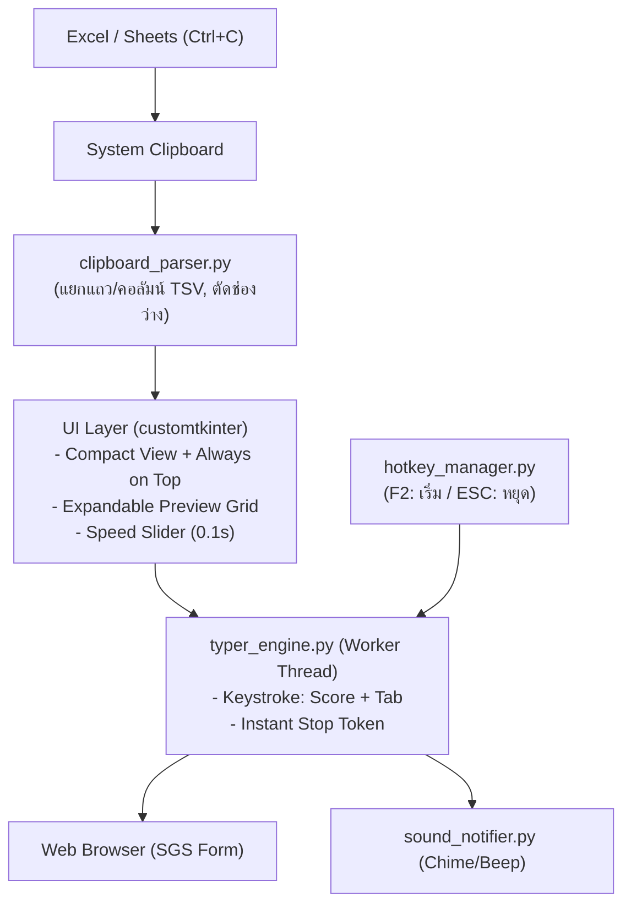

# AutoSGS: Project Memory & Brain (`gemini.md`)

> **AutoSGS** — ระบบช่วยพิมพ์คะแนนอัตโนมัติจาก Clipboard สำหรับครูผู้สอนบันทึกคะแนนในระบบ SGS (Secondary Grading System)

---

## 1. ภาพรวมและบริบทโปรเจกต์ (Context & Vision)

- **ปัญหาจริง (Real-World Pain Point):** ทุกสิ้นภาคเรียน ครูต้องคัดลอกคะแนนจาก Excel/Google Sheets มานั่งพิมพ์ลงหน้าเว็บ SGS ทีละช่องแบบ `คะแนน + Tab` นับร้อยนับพันคน ทำให้เกิดความล่าช้า ปวดเมื่อยมือ และเสี่ยงพิมพ์ผิด
- **โซลูชัน (The Solution):** โปรแกรม Desktop Utility ขนาดเล็กแบบ Portable คลิกเปิดใช้ได้ทันที ไม่ต้องติดตั้งโปรแกรมหรือ Python ช่วยอ่านข้อมูลจาก Clipboard แล้วจำลองการพิมพ์และกด Tab ให้อัตโนมัติอย่างรวดเร็ว ปลอดภัย และแม่นยำ

---

## 2. กฎเหล็กและพฤติกรรมหลักของระบบ (Core Business Logic & Rules)

1. **โหมดการพิมพ์และลำดับ Traversal (3 Grading Modes):**
   - **โหมด 1: ผลการเรียน (Academic Scores):** ทุกช่อง (1 ถึง $N$) พิมพ์คะแนน + `Tab` 1 ครั้ง ข้ามไปคนถัดไปทันที (ไม่มี Tab เพิ่มเติมท้ายแถว)
   - **โหมด 2: คุณลักษณะอันพึงประสงค์ (8 ตัวชี้วัด):** ช่อง 1–8 พิมพ์คะแนน + `Tab` 1 ครั้ง (8 Tabs) **แล้วส่ง `Tab` เพิ่มอีก 4 ครั้งท้ายแถว** เพื่อข้ามช่องสรุป/ผลประเมิน/แก้ไข ไปยังช่องที่ 1 ของนักเรียนคนถัดไป
   - **โหมด 3: การอ่าน คิดวิเคราะห์และเขียน (5 ตัวชี้วัด):** ช่อง 1–5 พิมพ์คะแนน + `Tab` 1 ครั้ง (5 Tabs) **แล้วส่ง `Tab` เพิ่มอีก 3 ครั้งท้ายแถว** เพื่อข้ามช่องสรุปผลไปยังช่องที่ 1 ของนักเรียนคนถัดไป
2. **การจัดการช่องว่าง (Empty Cells):**
   - หากช่องใดเป็นช่องว่าง (เด็กขาด/ยังไม่มีคะแนน) ให้ส่ง **`Tab` เปล่า** ข้ามไปทันทีโดยไม่พิมพ์อะไร
3. **การสั่งเริ่มพิมพ์สองทาง (Dual Trigger):**
   - **Countdown:** กดปุ่ม "เริ่ม" แล้วมีเวลานับถอยหลัง 3 วินาที (3.. 2.. 1..) ให้สลับหน้าจอไปคลิกช่องแรก
   - **Global Hotkey:** สลับไปคลิกช่องแรกในเว็บแล้วกด `F2` (หรือปุ่มที่ตั้งค่า) เพื่อเริ่มพิมพ์ทันที
4. **ความปลอดภัยสูงสุด (Emergency Stop / Kill Switch):**
   - กดปุ่ม **`ESC`** ขณะพิมพ์ จะต้องสั่งหยุดการพิมพ์ทันทีในระดับมิลลิวินาที ($< 50$ms)
5. **การแจ้งเตือน (Notifications):**
   - มีเสียง Beep นับถอยหลัง และเสียง Chime เมื่อพิมพ์ครบทุกช่อง
6. **ความเร็วที่ปรับแต่งได้แยกตามโหมด (Per-Mode Independent Delay & Turbo Speed):**
   - มี Slider ปรับ Delay ระหว่างช่อง (0.01s – 0.50s)
   - โหมดผลการเรียน: ค่าเริ่มต้น 0.10 วินาที (100ms) ปลอดภัยสำหรับฟอร์มที่มีการประมวลผลคะแนน
   - โหมดคุณลักษณะฯ และโหมดการอ่านฯ: ค่าเริ่มต้นความเร็วสูงสุด 0.02 วินาที (20ms ⚡) เนื่องจากบันทึกครั้งเดียวท้ายฟอร์ม
   - ระบบจะจำและบันทึกค่าความเร็วแยกอิสระตามแต่ละโหมดอัตโนมัติ
7. **ระบบตรวจสอบและแจ้งเตือนจำนวนช่อง (Smart Column Validation):**
   - มีระบบตรวจนับคอลัมน์จากคลิปบอร์ด หากเลือกโหมดคุณลักษณะฯ หรือการอ่านฯ แล้วคอลัมน์ไม่ตรงกับ 8 หรือ 5 ช่อง ระบบจะมีข้อความแจ้งเตือนที่หน้าต่างหลัก
8. **การแจ้งเตือนกดบันทึกใน SGS (Save Reminder Banner):**
   - หลังพิมพ์เสร็จสิ้นในโหมดคุณลักษณะอันพึงประสงค์ (8 ช่อง) และโหมดการอ่าน คิดวิเคราะห์และเขียน (5 ช่อง) ระบบจะแสดงแถบเตือนสีส้มเด่นชัดบนหน้าต่างโปรแกรมและเปลี่ยนข้อความสถานะ เพื่อเตือนให้ครูกดปุ่มบันทึกในหน้าเว็บ SGS เสมอ

---

## 3. สถาปัตยกรรมทางเทคนิค (Tech Stack & Architecture)

- **Language:** Python 3.10+ (ทดสอบและใช้งานบน Python 3.13)
- **GUI Framework:** `customtkinter` (โมเดิร์น สวยงาม รองรับ Dark/Light mode, High-DPI scaling)
- **Keystroke Simulation & Hotkeys:** `pynput` (ทำงานข้ามแพลตฟอร์มทั้ง Windows และ macOS)
- **Clipboard Management:** `pyperclip`
- **Audio:** Built-in `winsound` (Windows) / `afplay` (macOS) ทำงานแบบ Non-blocking
- **Packaging:** `pyinstaller` รวมเป็น Single-file Portable `.exe` (Windows) และ Standalone Binary/App (macOS)
- **Testing:** `pytest`

### ผังโครงสร้างการทำงาน (System Flow)


---

## 4. โครงสร้างไฟล์ในโปรเจกต์ (File Tree)

```text
D:\TUNorth\apps\sgs/
│
├── .github/                       # GitHub Actions Workflows
│   └── workflows/
│       └── build_release.yml      # CI/CD Build & Publish Release อัตโนมัติ
├── .gitignore                     # กำหนดไฟล์ที่ไม่ติดตามใน Git (build, dist, cache)
├── README.md                      # เอกสารแนะนำโปรเจกต์และลิงก์ดาวน์โหลด
├── gemini.md                      # [THIS FILE] สมองและบริบทของโปรเจกต์
├── requirements.txt               # รายการ Dependencies
├── test_phase1_manual.py          # สคริปต์ทดสอบ Phase 1 แบบ Interactive
├── main.py                        # จุดเริ่มต้นรันแอปพลิเคชัน (Phase 2+)
│
├── autosgs/                       # โค้ดหลักของโปรแกรม
│   ├── __init__.py
│   ├── core/                      # Core Automation Engine
│   │   ├── __init__.py
│   │   ├── clipboard_parser.py    # อ่าน & จัดรูปแบบตาราง TSV
│   │   ├── typer_engine.py        # จำลองการพิมพ์ Keystroke & Emergency Stop
│   │   ├── hotkey_manager.py      # ดักจับ Global Hotkey (F2/ESC)
│   │   ├── sound_notifier.py      # ระบบเสียงเตือนข้ามแพลตฟอร์ม
│   │   ├── config_manager.py      # จัดการบันทึกการตั้งค่า (Phase 2)
│   │   └── font_manager.py        # จัดการและลงทะเบียนฟอนต์ Prompt (Windows/Mac)
│   │
│   └── ui/                        # ส่วนติดต่อผู้ใช้ (Phase 2)
│       ├── __init__.py
│       ├── app.py                 # หน้าต่างหลัก (Compact + Preview)
│       └── settings_dialog.py     # หน้าต่างตั้งค่าปุ่มลัดและเสียง
│
├── tests/                         # ชุดการทดสอบ
│   ├── __init__.py
│   ├── mock_sgs.html              # หน้าเว็บ HTML จำลองฟอร์ม SGS สำหรับทดสอบ
│   ├── test_clipboard_parser.py   # Unit tests สำหรับตัวอ่านคลิปบอร์ด
│   ├── test_typer_engine.py       # Unit tests สำหรับจำลองการพิมพ์
│   ├── test_hotkey_manager.py     # Unit tests สำหรับดักปุ่มลัด
│   └── test_sound_notifier.py     # Unit tests สำหรับเสียงแจ้งเตือน
│
├── docs/                          # เอกสารข้อกำหนดและแผนงาน
│   ├── spec.md                    # เอกสาร SRS และ Checklist รายละเอียดทุก Phase
│   ├── plan.md                    # แผนการสถาปัตยกรรม (Implementation Plan)
│   ├── user_guide.md              # คู่มือการใช้งานสำหรับครูผู้สอน
│   └── build_guide.md             # คู่มือขั้นตอนการ Build และคอมไพล์โปรแกรม
│
├── assets/                        # ไอคอนและไฟล์มีเดีย (ico, png, icns, fonts)
│   ├── icon.ico                   # ไอคอน Windows (.ico)
│   ├── icon.png                   # ไอคอนต้นฉบับ (.png)
│   ├── icon.icns                  # ไอคอน macOS (.icns)
│   └── fonts/                     # ฟอนต์ Prompt (Regular, SemiBold, Bold)
│
└── packaging/                     # สคริปต์สำหรับ Build ไฟล์แจกจ่าย (Phase 4)
    ├── build_windows.bat
    └── build_mac.sh
```

---

## 5. คำสั่งสำคัญสำหรับนักพัฒนา (Essential Commands)

| การทำงาน | คำสั่ง |
| :--- | :--- |
| **รัน Automated Tests ทั้งหมด** | `pytest -v` |
| **รันสคริปต์ทดสอบ Engine (Phase 1)** | `python test_phase1_manual.py` |
| **ติดตั้ง Dependencies** | `pip install -r requirements.txt` |
| **รันโปรแกรม AutoSGS (เมื่อมี UI)** | `python main.py` |
| **Build ไฟล์ Portable .exe (Windows)** | `packaging\build_windows.bat` |
| **Build ไฟล์ Standalone .app (macOS)** | `./packaging/build_mac.sh` |
| **Push โค้ดขึ้น GitHub** | `git push origin main` |
| **ปล่อย Release ใหม่ผ่าน Git Tag** | `git tag vX.Y.Z && git push origin vX.Y.Z` |

---

## 6. สถานะการพัฒนาปัจจุบันและ Roadmap (Roadmap Status)

- [x] **Phase 1: Core Engine & Automation Logic (เสร็จสมบูรณ์ 100%)**
  - [x] Clipboard Parser (รองรับหลายคอลัมน์, จัดการช่องว่าง, ข้อมูลภาษาไทย)
  - [x] Typer Engine (Background Thread, Row-by-Row, Delay control, Sub-millisecond Stop)
  - [x] Hotkey Manager (F2 เริ่มพิมพ์, ESC หยุดฉุกเฉิน)
  - [x] Cross-platform Sound Notifier (Beep, Chime, Alert)
  - [x] Unit Tests 11/11 รายการผ่านสมบูรณ์
  - [x] Interactive Manual Test Script & Mock Web Form

- [x] **Phase 2: Modern Desktop UI Development (เสร็จสมบูรณ์ 100%)**
  - [x] หน้าต่างหลัก CustomTkinter (Compact Mode + Always on Top)
  - [x] ตัวนับเวลาถอยหลัง (Countdown Overlay) และแถบสถานะ Progress Bar
  - [x] หน้าต่างพรีวิวตารางข้อมูลแบบขยาย/พับได้ (Collapsible Preview Panel)
  - [x] ตัวจัดการตั้งค่า `config_manager.py` (`~/.autosgs/config.json`)
  - [x] หน้าต่างบันทึกปุ่มลัด `settings_dialog.py`

- [x] **Phase 3: Integration & System Verification (เสร็จสมบูรณ์ 100%)**
  - [x] เชื่อมต่อ Event ระหว่าง UI และ Core Engine แบบ Thread-safe
  - [x] ฟอร์มจำลอง SGS Web Form 3 โหมด (ผลการเรียน, คุณลักษณะฯ, การอ่านฯ) พร้อมปุ่มคัดลอกข้อมูลตัวอย่าง
  - [x] ทดสอบความเร็ว Emergency Stop Latency (< 50ms) ผ่านเกณฑ์
  - [x] Automated Unit & Integration Tests ทั้งหมด 27/27 รายการผ่านสมบูรณ์

- [x] **Phase 4: Packaging & DevOps CI/CD (เสร็จสมบูรณ์ 100%)**
  - [x] PyInstaller สคริปต์ทำ Portable `.exe` แบบ Single File (Windows)
  - [x] เพิ่มระบบรองรับ 3 โหมดการกรอกคะแนน (ผลการเรียน, คุณลักษณะฯ, การอ่านฯ)
  - [x] สคริปต์สำหรับ macOS พร้อมคำแนะนำ Accessibility
  - [x] จัดทำคู่มือผู้ใช้สำหรับครู (User Guide) และ README.md
  - [x] จัดทำคู่มือขั้นตอนการ Build และคอมไพล์โปรแกรม (Build Guide)
  - [x] ซิงค์ Source Code ขึ้น GitHub Repository (`https://github.com/NOGiTTiS/AutoSGS`) พร้อม `.gitignore`
  - [x] จัดทำไอคอน macOS `assets/icon.icns` รองรับ PyInstaller ข้ามแพลตฟอร์ม
  - [x] เพิ่ม Windows Version Resource (`packaging/version_info.txt`) กำหนด CompanyName, ProductVersion, FileDescription
  - [x] จัดทำสคริปต์ 1 คลิกปลดล็อก Windows SmartScreen (`packaging/Unblock_AutoSGS.bat`) และแพ็กเกจ `AutoSGS-Windows-Portable.zip`
  - [x] เพิ่มคำแนะนำและแนวทางแก้ไข Microsoft Defender SmartScreen ใน README, คู่มือผู้ใช้ และ GitHub Releases
  - [x] GitHub Actions CI/CD สร้างและเผยแพร่ GitHub Release `v1.0.0` และ `v1.1.0` อัตโนมัติสำเร็จ 100%
